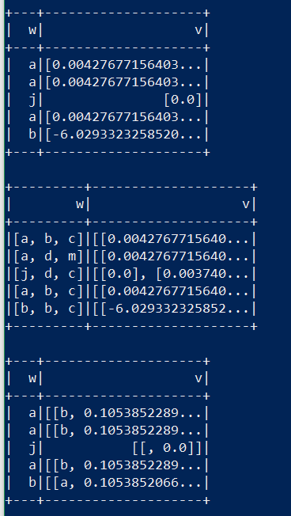

## Veronica


首先这个项目参考了

* [spark sql在喜马拉雅的使用之xql](https://github.com/cjuexuan/mynote/issues/21)
* [StreamingPro](https://github.com/allwefantasy/streamingpro)
* 还有一个 [IQL](https://github.com/teeyog/IQL) 的项目使用了类似的语法，可以参考
* 没有使用Scala，而是使用了Python来实现功能，主要基于pyspark2.3.0


主要特点

* 简单优雅的交互方式
* 会支持多种数据源及数据格式
* 支持批处理以及流式计算
* 通过web常驻spark服务，可配合前后端形成一整套大数据体系
* 侧重点会放在ML机器学习上，通过Python与各种MLLib无缝连接


Quick-start

```sql
-- 设置一些全局的变量供后续使用
set data_dir = "/home/w4n9/Code/Github/veronica/xql";

-- 加载数据,映射为spark dataframe
load csv.`{data_dir}/test.csv` as temp1;

-- 对数据做一些预处理
select split(_c0," ") as words from temp1 as temp2;

-- 使用word2vec算法训练模型，并保存在目录中
train temp2 as word2vec.`{data_dir}/model` where inputCol="words" and minCount="2";

-- 将模型注册为一个UDF函数
register word2vec.`{data_dir}/model` as w2v_predict;

-- 使用模型开始预测
select words[0] as w, w2v_predict(words[0]) as v from temp2 as result;

-- 将预测结果以json的形式保存起来
save overwrite result as json.`{data_dir}/predict`;
```

可以看一下结果




项目还处在开发中，整体框架还未完善，暂时只能提供最简单的功能
